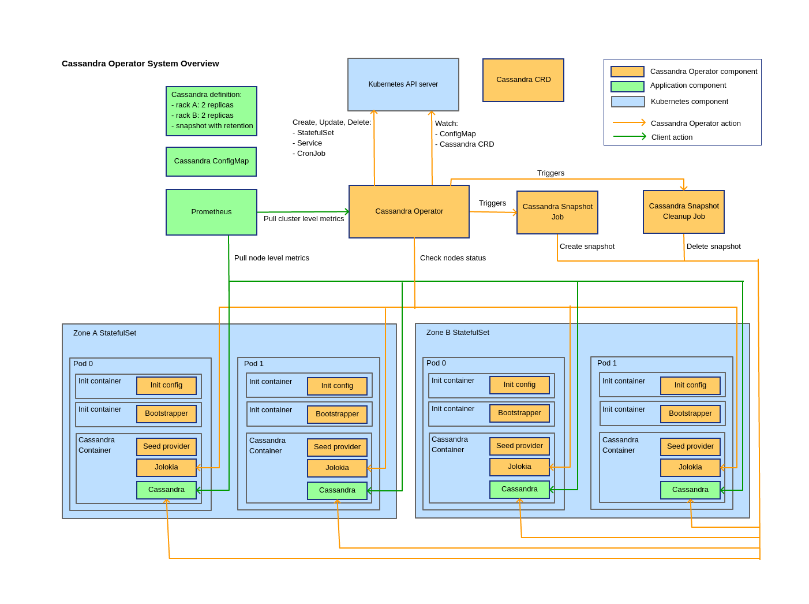
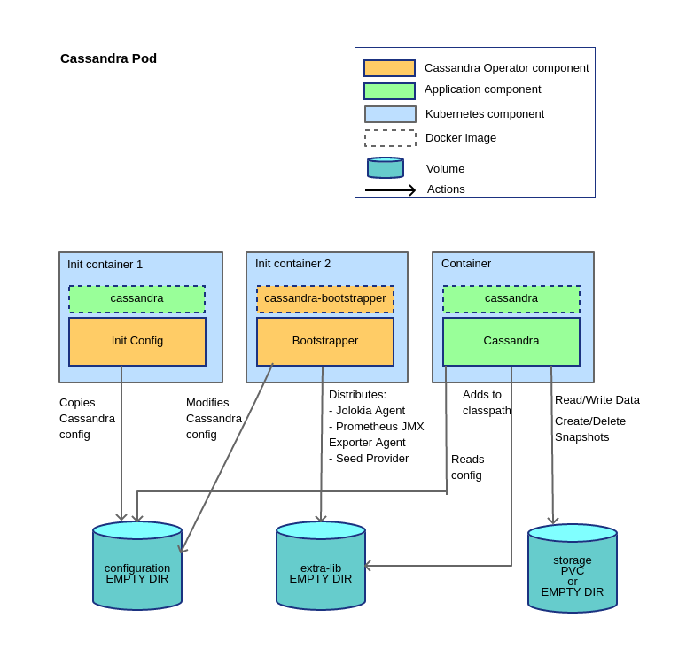

# Overview

The Cassandra Operator is primarily composed of 3 components:
- [cassandra-operator](../cassandra-operator/README.md): the operator responsible for the lifecycle of the clusters in Kubernetes
- [cassandra-bootstrapper](../cassandra-bootstrapper/README.md): a component responsible for configuring the Cassandra node before it can be started
- [cassandra-snapshot](../cassandra-snapshot/README.md): a component responsible for taking and deleting snapshots given a retention policy 

It allows users to run Cassandra clusters within Kubernetes without needing to manually perform tasks
such as creating `StatefulSet` resources or manually configuring Cassandra when new members are added. The user can specify
their requirements for what the operator should create by using the [Custom Resource Definition](https://kubernetes.io/docs/concepts/extend-kubernetes/api-extension/custom-resources/) (CRD) provided.
These definitions are stored and retrieved from the Kubernetes API Server and must be setup in the cluster before they can be used.

For each defined cluster, the operator will create `StatefulSet` resources for each availability zone (rack), a headless `Service`
for instance discovery via DNS and, if automatic snapshots are enabled, `CronJob` resources for initiating snapshots and snapshot cleanups. It is
important to note that the operator does not manage the Cassandra pods directly, instead transforming the CRD into other Kubernetes
resources which are then managed by their own Kubernetes Controllers. 

The following table outlines how the Cassandra concepts are represented in Kubernetes. 

| Cassandra | Kubernetes Resource |
| --- | --- |
| Cluster (Single DC)|`Cassandra` CRD|
| Rack | `StatefulSet` |
| Node | `Pod` |

The operator watches for updates to Cassandra CRDs within the namespaces it has been configured to monitor. When an update
occurs it will perform some validation against the new values and then update the relevant `StatefulSet`, `Service` and `CronJob`
resources. For example if the number of replicas within each rack is increased in the CRD the number of replicas in the Spec of the
`StatefulSet` will be updated. This will in turn trigger new pods to be created by the `StatefulSet` controller. The
operator will wait for each rack to be fully updated before updating the next rack to ensure that disruption is kept to a
minimum.

The configuration for Cassandra will use the default configuration files from the user provided image with some changes
applied by the bootstrapping process to enable it to work within Kubernetes. However, the user of the operator can
change the cassandra configuration by adding a companion `ConfigMap`, which allows the user to replace any default file
within the Cassandra configuration directory. This includes logback configuration as well as the cassandra.yaml file. 
It should be noted that this replaces the default configuration only, so the bootstrapping process will still apply its changes
to allow the cluster to work within Kubernetes.

The operator manages and watches resources by interacting with the Kubernetes API Server. Once a cluster is running, the
operator interacts with each Pod to extract metrics which are then exposed by the operator on a HTTP endpoint in Prometheus
format. Each pod of the cluster uses a custom Cassandra seed-provider to discover other members by interacting with the
Kubernetes API Server. The following diagram shows how these components interact.

The following diagram illustrates how the components interact together when the Operator manages a 4-node cluster with snapshot enabled:

### Cassandra Resource

The operator uses a Custom Resource Definition to allows users of the operator to define requirements for Cassandra clusters they
wish to create. This approach allows users to interact with the operator in a way similar to managing `Deployment` and `StatefulSet` resources.
That is, commands such as `kubectl get cassandra` are supported. An example of a Cassandra resource is available on the [WIKI](https://github.com/sky-uk/cassandra-operator-wiki).

### Stateful Sets

The operator uses `StatefulSet` resources as each Cassandra instance must maintain an identity, that is pods should have the same cluster ID
and dataset even if a pod is restarted. 

The operator creates a `StatefulSet` definition for each Cassandra rack so that the configured racks can mirror the [zones](https://kubernetes.io/docs/setup/multiple-zones)
concept within Kubernetes. It achieves this by creating a `StatefulSet` for each zone and then using the Pod Node Affinity to schedule each cassandra pod
within a Kubernetes failure zone by using the `failure-domain.beta.kubernetes.io/zone` label. The value of the Zone field within the rack definition is matched with the 
value of the `failure-domain.beta.kubernetes.io/zone` label.

The operator creates `StatefulSet` definitions one zone at a
time and will avoid creating the next zone until the zone being deployed is fully ready, so that each rack is fully scaled up before creating the next zone. In addition,
each `StatefulSet` will only allow one instance at a time to be rolled out to ensure availability. This limit together with the zone-by-zone behaviour means that only one
instance at a time will be rolled out by the operator including across multiple racks. The number of replicas for each `StatefulSet` will match the number of replicas defined
for each rack in the Custom Resource Definition.

When a `StatefulSet` is created, the `StatefulSet` controller within Kubernetes will create each pod starting from index 0 to the number
of replicas defined. Updates to the `StatefulSet` resources managed by the operator are rolled out in the same way as they are created, however 
the instances are restarted in reverse order as is usual for a `StatefulSet` using a `RollingUpdate` strategy.

# Seed Nodes

Cassandra requires some instances to act as [Seed Nodes](http://cassandra.apache.org/doc/4.0/faq/#what-are-seeds) to allow new instances to join the cluster. To allow all instances to discover the other
members of the cluster, a custom [seed-provider](cassandra-bootstrapper/seed-provider/README.md) has been created. This seed provider
uses the numbering provided by the `StatefulSet` behaviour, which labels each pod in a stateful set from 0..n. If the Cassandra CRD contains
multiple racks, the seed-provider will designate node 0 of each `StatefulSet` to act as a seed node. In the case where there is only a single
rack, the seed-provider will indicate instances 0 to `min(floor(clusterSize / 2), 3)` will act as the seeds. These members are discovered by
looking up the corresponding Cassandra CRD to discover the number of racks, and then uses the Kubernetes cluster DNS to translate the pod names
to IP Addresses. If the DNS lookup fails (for example if the pod has not been created yet), then it is omitted from the seed list.

# Cassandra Instances

Each cassandra instance is created as a Kubernetes Pod, which in turn is managed by a `StatefulSet`. The pod consists of
two [Init Containers](https://kubernetes.io/docs/concepts/workloads/pods/init-containers/) and a single container.

This setup uses three volumes:
  - `configuration`: an `EmptyDir` volume which holds Cassandra configuration files.

  - `extra-lib`: another `EmptyDir` volume which holds JAR files for agents used by the cluster.

  - `storage`: long-term storage for each Cassandra instance. This will create a `PersistentVolumeClaim`
     which will then be allocated to a `PersistentVolume` by the Kubernetes cluster. Usually the cluster's
     cloud-provider will take care of provisioning and mounting the underlying volume.

     If a short lived cluster for testing purposes is needed, the user may configure the cluster to use a `EmptyDir`
     volume for storage instead of creating a `PersistentVolumeClaim`. This means that the data for each instance will
     be lost when each pod is deleted or updated, and it will be treated by the other members of the Cassandra cluster
     as a completely new instance joining the cluster.

The init-containers run in the following order:

  1. `init-config`: copies the configuration from the `/etc/cassandra` directory of the cluster's base Cassandra image
      into the `configuration` volume.

  2. `cassandra-bootstrapper`: runs the [cassandra-bootstrapper](../cassandra-bootstrapper/README.md) utility using the data in the `configuration` volume. Amongst other changes, this allows
     the [seed-provider](../cassandra-bootstrapper/seed-provider/README.md) to be added to the classpath and for the
     Jolokia and Prometheus JMX exporter agents to be configured as Java agents. This results in the files within
     `configuration` being updated and the jar files for the two agents and the seed-provider being copied into the
     `extra-lib` directory.

It's worth noting that in step 2 above, only the parts of configuration which are required for the operator to run are
modified, and all other configuration from the base Cassandra image is left unmodified.

After the initialisation has completed the Cassandra image will be run. The `configuration` volume will be mounted at
`/etc/cassandra`, replacing the default configuration from the docker image. Additionally, the `extra-lib` directory
populated by the `cassandra-bootstrapper` init-container is mounted so that the ClassLoader can load the additional JAR
files.

The initialisation of each Cassandra pod is performed this way to avoid the need for a custom Cassandra image. This allows users to change the Cassandra image and version they are using.
However, in order to be compatible with the initialisation process outlined above, the image must conform to the following:
- Default config must be located in `/etc/cassandra`
- Cassandra expects config to be in `/etc/cassandra`
- Adds the directories specified in the `EXTRA_CLASSPATH` environment variable to the Cassandra JVM classpath
  
The initialisation process has been designed to be compatible with the [Apache Cassandra image](https://hub.docker.com/_/cassandra) and has been tested with version 3.11, which is also the default.
Other 3.x versions are likely to be compatible but are not currently being tested with the operator.
 
Each Cassandra instance is configured by the [cassandra-bootstrapper](../cassandra-bootstrapper/README.md) to use a custom seed provider.
This [seed-provider](../cassandra-bootstrapper/seed-provider/README.md) uses the Kubernetes API Server to discover the other Cassandra instances.

# Configuration

The default configuration from the cassandra image may be changed by setting up a `ConfigMap` using the naming convention `{{cluster-name}}-config`.
The operator watches for `ConfigMap` creations, updates and deletions. If a `ConfigMap` matching this naming convention is found, it will be mounted
into the `bootstrapper` init-container, which will use any files present in the `ConfigMap` to overwrite the default configuration. For example, if a
`cassandra.yaml` key is specified within the `{{cluster-name}}-config` `ConfigMap`, it will overwrite the `cassandra.yaml` copied from `/etc/cassandra`
before the [cassandra-bootstrapper](../cassandra-bootstrapper/README.md) is run. This means that any configuration specified within the `ConfigMap` will
still be modified by the bootstrapper utility in order to configure the seed-provider.

When a `ConfigMap` for a cluster is created or updated the operator updates a label on the `StatefulSet` containing a
hash of the contents of the `ConfigMap`. Applying the label triggers a rolling restart of the pods in the
`StatefulSet`, which is necessary because Cassandra only reads configuration files on startup. A hash has been used as
this means that `ConfigMap` updates which contain the same underlying data as a previously applied `ConfigMap` will not
trigger an unnecessary rolling restart. Further, this design also ensures that in the event of a configuration error
severe enough to cause Cassandra to fail to start, the rollout will stop at the first instance.

If the `ConfigMap` is removed the associated label is also removed.